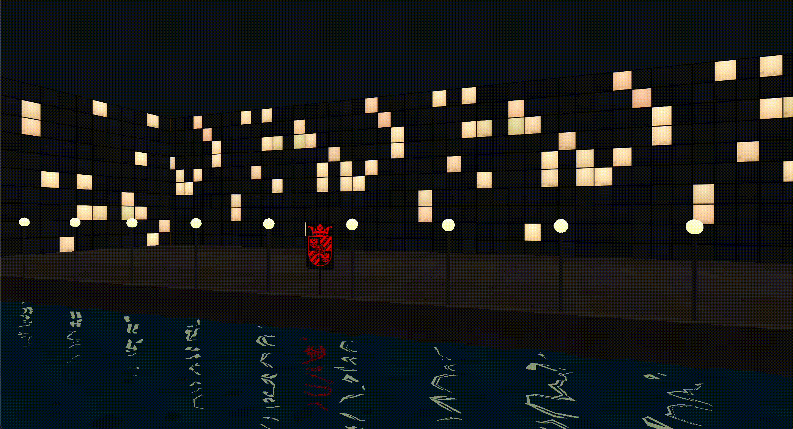
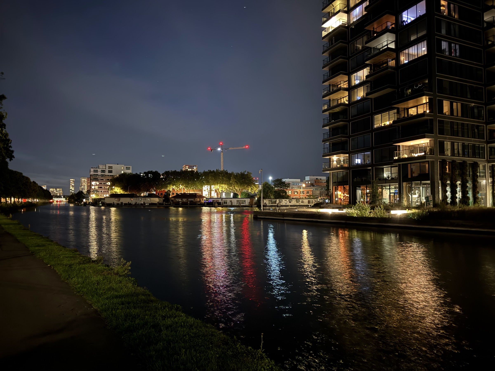
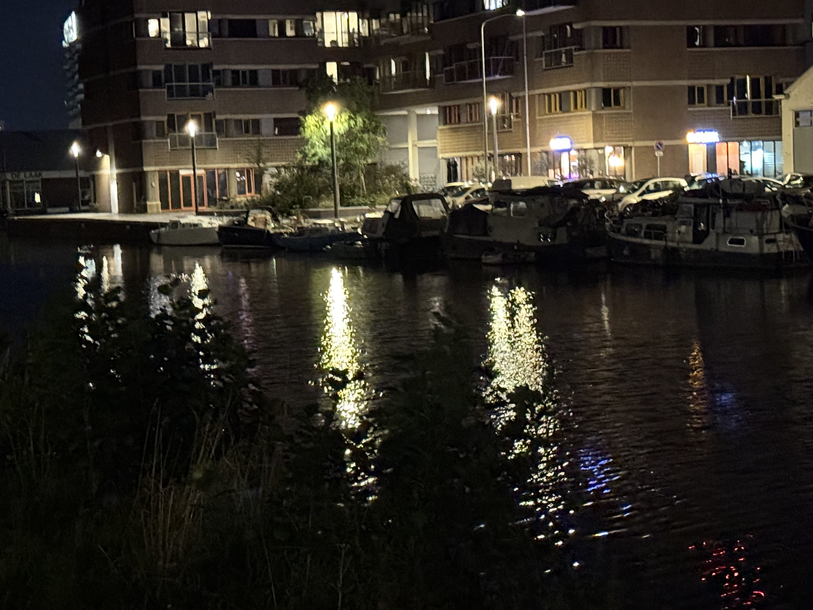

# Screen Space Reflections and Water Shader for OpenGL

This project was made as a submission to the RUG Computer Graphics Course Competition 2025. It implements a screen space reflections (SSR) shader in OpenGL using a deferred rendering pipeline.

> Author: Julius van Voorden (j.van.voorden@student.rug.nl)

## Final Product

The following GIF showcases the real-time rendered screen space reflections effect on a water surface in action:

## Assets

All models have been hand made for the competition using Blender. The RUG Logo for the emissive sign was sourced from an official RUG publication and cropped to fit the model. Two external textures under CC0 license were used for the concrete floor and apartment building facade:

- [Facade](https://ambientcg.com/view?id=Facade002)
- [Concrete Wall](https://polyhaven.com/a/concrete_wall_006)

## Inspiration

Early on in the semester I was visiting a friend in Den Haag, NL. During a night time walk along the water, I noticed beautiful reflections of different lights in the very slightly rippling water surface. I took some reference pictures and used them as inspiration throughout the project:

## Quick overview of the SSR technique

From my research I have found that the screen space reflection ray tracing can be done on a pixel level, using a pixel-tracer similar to what advanced voxel tracer engines do in 3D. Alternatively, one can step through view( / world) space using a small enough fixed step size. Even though this solution is less accurate and can be more performance intensive if the step size is too small, it seemed easier to implement, so I went with this approach for this project. The SSR algorithm can be found in the `lighting_frag.glsl` shader.

## The water shader

The water shader was made using a custom 2d wave height function, consisting of a mix of sin and perlin noise.
The normals were calculated not analytically but by sampling the height at small offsets and construct the tangent and bitangent vectors from there. This approach was easier to implement and gave satisfactory results, while allowing for completely dynamic waves.
The water plane needs more geometry that just two triangles to look good, so that waves can be represented properly. Ideally, a tesselation shader could be used to increase the geometry density near the camera, but due to time constraints I simply created a grid mesh in Blender with enough subdivisions.
The water shader can be found in the `watervert.glsl` shader.

## Deferred rendering pipeline

Screen space reflections rely on a postprocessing effect using geometry data of the entire screen. Therefore, a deferred rendering pipeline has to be used. I first render the scene geometry into multiple buffers, storing position, normal, albedo, reflectiveness and emission. Then I render a single full screen quad, which has sampler access to the previously rendered buffers. The fragment shader of this quad does all the heavy lifting and acts as a potential image postprocessing step. In this shader, the screen space reflections are calculated and mixed with the rest of the lighting. Finally, the resulting color is output to the default framebuffer. The deferred rendering pipeline can be found in the `mainview.cpp` file.

## Build and run instructions

This QT project should be buildable and runnable using QT Creator. I don't use QT Creator myself, so I included a `sr/run.sh` that I have been using as a convenient way to build and run the project from the terminal.

### Quick note on missing git history

This project was originally part of a mono repo containing all assignments for the RUG Computer Graphics course. For the purpose of this competition submission, I have extracted only the relevant files for this project, so unfortunately the git history is missing. If you want to see the full history including all assignments, please contact me.
